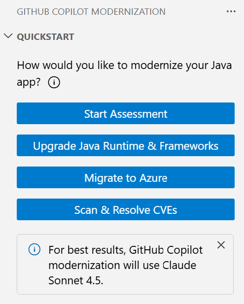
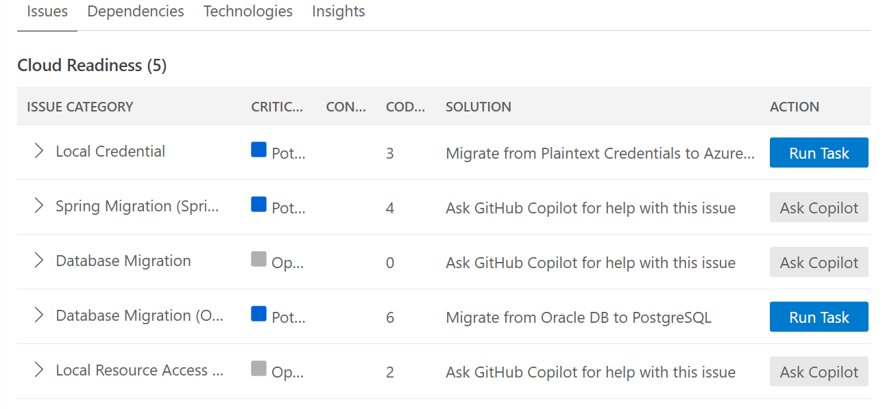
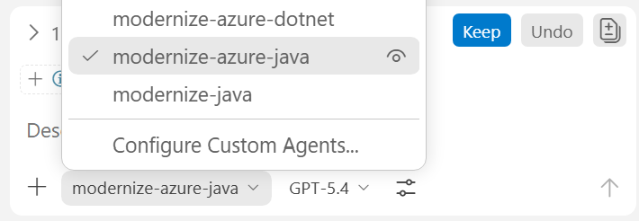
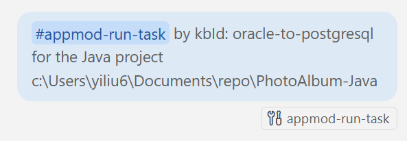
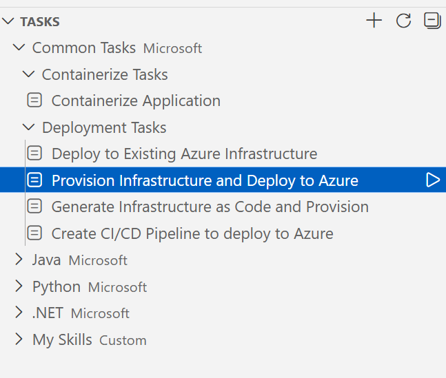
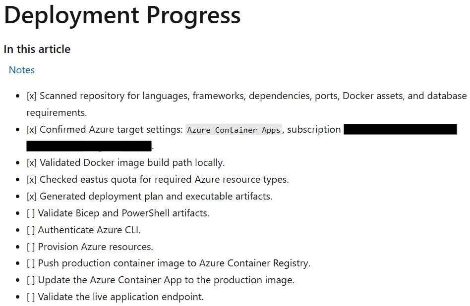

# Photo Album Application - Migration Workshop

This document serves as a comprehensive workshop guide that will walk you through the process of migrating a Java application to Azure using GitHub Copilot app modernization. The workshop covers assessment, database migration from Oracle to PostgreSQL, and deployment to Azure.

**What the Migration Process Will Do:**
The migration will transform your application from using Oracle Database to a modern Azure-native solution. This includes migrating from Oracle Database to Azure Database for PostgreSQL Flexible Server with managed identity authentication, and deploying it to Azure with proper monitoring and health checks.

## Table of Contents

- [Overview](#overview)
- [Running Locally (Pre-Migration)](#running-locally-pre-migration)
- [Prerequisites](#prerequisites)
- [Workshop Steps](#workshop-steps)
  - [Step 1: Assess Your Java Application](#step-1-assess-your-java-application)
  - [Step 2: Migrate from Oracle to PostgreSQL](#step-2-migrate-from-oracle-to-postgresql)
  - [Step 3: Deploy to Azure](#step-3-deploy-to-azure)

## Overview

The Photo Album application is a Spring Boot web application that allows users to:
- Upload photos via drag-and-drop or file selection
- View photos in a responsive gallery
- View photo details with metadata
- Navigate between photos
- Delete photos

**Original State (Before Migration):**
* Oracle Database 21c Express Edition for photo storage
* Photos stored as BLOBs in Oracle Database
* Password-based authentication
* Running in Docker containers locally

**After Migration:**
* Azure Database for PostgreSQL Flexible Server
* Managed Identity passwordless authentication
* Deployed to Azure Container Apps

**Time Estimates:**
The complete workshop takes approximately **40 minutes** to complete. Here's the breakdown for each major step:
- **Assess Your Java Application**: ~5 minutes
- **Migrate from Oracle to PostgreSQL**: ~15 minutes
- **Deploy to Azure**: ~20 minutes

## Running Locally (Pre-Migration)

Before starting the migration, you can run the original Oracle-based application locally to understand how it works.

### Quick Start with Docker Compose

1. **Clone the repository** (if not already done):
   ```bash
   git clone https://github.com/Azure-Samples/PhotoAlbum-Java-Lite.git
   cd PhotoAlbum-Java-Lite
   ```

2. **Start the application**:
   ```bash
   docker-compose up --build -d
   ```

   This will:
   - Start Oracle Database 21c Express Edition container
   - Build and start the Photo Album application container
   - Automatically create the database schema

3. **Wait for services to start** (~2-3 minutes for Oracle DB initialization on first run)

4. **Access the application**:
   - Open your browser to **http://localhost:8080**
   - Upload, view, and manage photos to explore the features

5. **Stop the application**:
   ```bash
   docker-compose down
   ```

   To remove data volumes as well:
   ```bash
   docker-compose down -v
   ```

## Prerequisites

Before starting this workshop, ensure you have:

### Required Software

- **Operating System**: Windows, macOS, or Linux
- **Java Development Kit (JDK)**: JDK 21 or higher
  - Download from [Microsoft OpenJDK](https://learn.microsoft.com/java/openjdk/download)
- **Maven**: 3.8.0 or higher
  - Download from [Apache Maven](https://maven.apache.org/download.cgi)
- **Docker Desktop**: Latest version, required if you want to run locally
  - Download from [Docker](https://docs.docker.com/desktop/)
- **Git**: For version control
  - Download from [Git](https://git-scm.com/)

### IDE and Extensions

- **Visual Studio Code**: Version 1.101 or later
  - Download from [Visual Studio Code](https://code.visualstudio.com/)
- **GitHub Copilot**: Must be enabled in your GitHub account
  - [GitHub Copilot subscription](https://github.com/features/copilot) (Pro, Pro+, Business, or Enterprise)
- **VS Code Extensions** (Required):
  1. **GitHub Copilot** extension
     - Install from [VS Code Marketplace](https://marketplace.visualstudio.com/items?itemName=GitHub.copilot)
     - Sign in to your GitHub account within VS Code
  2. **GitHub Copilot app modernization** extension
     - Install from [VS Code Marketplace](https://marketplace.visualstudio.com/items?itemName=vscjava.migrate-java-to-azure)
     - Restart VS Code after installation

### Azure Requirements

- **Azure Account**: Active Azure subscription
  - [Create a free account](https://azure.microsoft.com/free/) if you don't have one
- **Azure CLI**: Latest version
  - Download from [Azure CLI](https://docs.microsoft.com/cli/azure/install-azure-cli)

### Configuration

- Ensure `chat.extensionTools.enabled` is set to `true` in VS Code settings
- In the Visual Studio Code settings, make sure this setting is enabled (it might be controlled by your organization)
- Access to public Maven Central repository for Maven-based projects
- Git-managed Java project using Maven

## Workshop Steps

### Step 1: Assess Your Java Application

The first step is to assess the Photo Album application to identify migration opportunities and potential issues.

#### 1.1 Open the Project

1. Clone or open the Photo Album project in Visual Studio Code:

```bash
git clone https://github.com/Azure-Samples/PhotoAlbum-Java-Lite.git
cd PhotoAlbum-Java-Lite
code .
```

#### 1.2 Install GitHub Copilot App Modernization Extension

In VS Code, open the Extensions view from the Activity Bar, search for the `GitHub Copilot app modernization` extension in the marketplace. Click the Install button for the extension. After installation completes, you should see a notification in the bottom-right corner of VS Code confirming success.

#### 1.3 Run Assessment

1. In the Activity sidebar, open the **GitHub Copilot app modernization** extension pane.
1. In the **QUICKSTART** section, click **Start Assessment** to trigger the app assessment.

    

1. Wait for the assessment to be completed. This step could take several minutes.
1. Upon completion, an **Assessment Report** tab opens. This report provides a categorized view of cloud readiness issues and recommended solutions. Select the **Issues** tab to view proposed solutions and proceed with migration steps.

#### 1.4 Review Assessment Report

The Assessment Report provides:

- **Application Information**: Summary of detected technologies and frameworks
- **Issues**: Categorized list of migration opportunities
  - **Database Migration**: Oracle Database → Azure Database for PostgreSQL
  - **Security**: Current password-based authentication
- **Recommended Solutions**: Predefined migration tasks for each issue

Look for the following in your report:

1. **Database Migration (Oracle Database)**
   - Detected: Oracle Database 21c
   - Recommendation: Migrate to Azure Database for PostgreSQL Flexible Server
   - Action: **Run Task** button available

    

### Step 2: Migrate from Oracle to PostgreSQL

Before running the migration task in Copilot Chat, make sure the chat is configured to use your preferred LLM model, to choose the model:

1. Open Copilot Chat in **Agent** mode.
1. Select the custom agent **modernize-azure-java** from the agent picker.
1. Select the a model from the model picker, e.g., **GPT-5.4**.

    

Now that you've assessed the application, let's begin the database migration from Oracle to Azure Database for PostgreSQL.

1. In the **Assessment Report**, locate the **Database Migration (Oracle)** issue
1. Click the **Run Task** button next to **Migrate to Azure Database for PostgreSQL (Spring)**

1. The Copilot Chat panel opens in **Agent Mode** with a pre-populated migration prompt

    

1. The Copilot Agent will analyze the project, generate and open **plan.md** and **progress.md**, then automatically proceed with the migration process.
1. The agent checks the version control system status and checks out a new branch for migration, then performs the code changes. Click **Allow** for any tool call requests from the agent.
1. When the code migration is complete, the agent will automatically run a **validation and fix iteration loop** which includes:
   - **CVE Validation**: Detects Common Vulnerabilities and Exposures in current dependencies and fixes them.
   - **Build Validation**: Attempts to resolve any build errors.
   - **Consistency Validation**: Analyzes the code for functional consistency.
   - **Test Validation**: Runs unit tests and automatically fixes any failures.
   - **Completeness Validation**: Catches migration items missed in the initial code migration and fixes them.
1. After all validations complete, the agent generates a **summary.md** as the final step.
1. Review the proposed code changes and click **Keep** to apply them.

### Step 3: Deploy to Azure

At this point, you have successfully migrated the application to PostgreSQL. Now, you can deploy it to Azure.

1. In the Activity sidebar, open the **GitHub Copilot app modernization** extension pane. In the **TASKS** section, expand **Common Tasks** > **Deployment Tasks**. Click the run button for **Provision Infrastructure and Deploy to Azure**.

    
1. A predefined prompt will be populated in the Copilot Chat panel with Agent Mode.

1. Click ****Continue**/**Allow** if pop-up notifications to let Copilot Agent analyze the project and create a deployment plan in **plan.copilotmd** with Azure resources architecture, recommended Azure resources for project and security configurations, and execution steps for deployment.

1. View the architecture diagram, resource configurations, and execution steps in the plan. Click **Keep** to save the plan and type in **Execute the plan** to start the deployment.

1. When prompted, click **Continue**/**Allow** in chat notifications or type **y**/**yes** in terminal as Copilot Agent follows the plan and leverages agent tools to create and run provisioning and deployment scripts, fix potential errors, and finish the deployment. You can also check the deployment status in **progress.copilotmd**. **DO NOT interrupt** when provisioning or deployment scripts are running.

    
